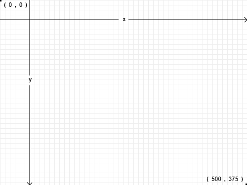

# Llamémoslo Superficie de dibujo
Los `<canvas>` son un elemento que se usa para diversos casos , los cuales pueden ser:
* Juegos 
* Gráficas
* Algunas imágenes

## Canvas invisibles

La sintaxis base de los "`<canvas>`"seria algo así:

    <canvas 
        height="300" 
        width="255"
    >
    </canvas>

Sintaxis con atributo "*id*"

    <canvas 
        id="[nombre]"
    >
    </canvas>

Con el identificador que le pongamos existe la posibilidad de poder encontrarlas con funciones JS

    Este código JS sirve para encontrar un elemento , en este caso algún canva
    var a_canvas = document.getElementById("a")

La función para poder dibujar una figura dentro de un canva es:

    function dibujaforma(){
                var canva_i= document.getElementById("canva_identificado");
                var contexto_c=canva_i.getContext("2d");
                contexto_c.fillRect(50,25,150,100);
            }

El comando que mas se resalta ahí es:

`var contexto_c=canva_i.getContext("2d");`

Ya que con este una vez que lo llamamos , con el elemento "***getContext***" lo pasamos a una cadena 2D.

 **Nota:**
*En la fecha que se lanzo este libro no existía como tal una cadena de 3D*

##### Draw Context 
Existe un grupo muy variado de métodos y propiedades las cuales se les pueden agregar a los "`<canvas>`" ,algunos ejemplos son estos:
* **fillStyle**: Con esta podemos establecer el color con el cual sera llenado el dibujo, viene con negro predeterminado.
* **fillRect**: Este es el que realiza el dibujo por medio de coordenadas y medidas en pixeles.
* **strokeStyle**: Realiza la misma función que "*fillStyle*"
* **strokeRect**: Este solamente dibuja los bordes de igual manera funciona con coordenadas y medidas en pixeles
* **clearRect**: Limpia los pixeles dentro de un rectángulo en especifico

## Coordenadas en los Canvas
Los elementos y los mismos "*canvas*" se posicionan por coordenadas, como en un modelo bidimensional ,algo semejante a esto:
            

Coordenada:  
X = ---
Y = |
 

## Paths (caminos)

Los `<canvas>` son como hacer un dibujo , tienes que empezar primero por los bocetos con un "*lapíz*" y dentro de HTML5 y JS se usan estos 2 métodos para dibujar lineas rectas:
* **moveTo(x,y)** indica el punto de partida de la linea
* **lineTo(x,y)** indica el punto final de la linea 
* **stroke()** Este es el cual marca las lineas para poder identificar de mejor manera los trazos
* **strokeStyle()** Este permite que le puedas dar algún color a los trazos

Cada linea puede tener su propio estilo siempre y cuando sea separado por el metodo "***beginPath()***" y "***closePath()***"

## Text

Dentro de los `<canvas>` se puede dibujar texto sin embargo no tendrá la gran mayoría de estilos ni atributos CSS ,los atributos que están disponibles para texto dentro de `<canvas>` son estos:
* **"font"**:Con esta se pueden usar valores como:
    * **style**
    * **variant**
    * **weight**
    * **size**
    * **height**
    * **family**
* **"textAling"**:Sirve para alinear el texto y los valores que se pueden usar son:
    * **start**
    * **end**
    * **left**
    * **right**
    * **center**
* **"textBaseline"**:Este permite controlar donde se coloca el texto y los valores son:
    * **top**
    * **hanging**
    * **middle**
    * **alplhabetic**
    * **ideographic**
    * **bottom**
    
    
## Gradients
    
   Este es un estilo que se le puede dar a los `<canvas>` para que tenga un degradado de color.
   
   Las funciones para crear el degradado son:
   
* "**createLinearGradient(x0 ,y0,x1,y1)**":Indica las partes donde sera dado el color del degradado (Para un degradado recto)  iniciando con "*x0*" y "*y0*" y terminando con "*x1*" y "*y1*".

* "**createRadialGradient(x0, y0, r0, x1, y1, r1)**":Indica las partes donde sera dado el color del degradado (Para un degradado radial)  iniciando con "*x0*" , "*y0*" y "*r0*" y terminando con "*x1*" y "*y1*".

Se debe crear un objeto para poder usar los degradados ,por ejemplo:

`var degradado = cox.createLinearGradient(0,0 ,300,0);`

Para determinar los colores es:

`my_gradient.addColorStop([numero de color], "[color]");`

Para asignarle el estilo al "*canva*":

`context.fillStyle = my_gradient;`

Para marcar el degradado en el "*canva*"

`context.fillRect(0, 0, 300, 225);`

Y por medio de las coordenadas se puede alterar la dirección hacia la que se desplaza el degradado.

## Imágenes 
Las imágenes pueden ser implementadas en la pagina web con 2 elementos: 
*   ``
*   `<canvas>`

Para poder imprimir una imagen con el elemento `<canva>` se tiene que usar el método "**drawImage()**" ,y tiene diferentes formas de uso:

* "**drawImage(image, dx ,dy)**" Con las coordenadas *(dx ,dy)* se posiciona la imagen en alguna parte del **"canva"**.
* "**drawImage(image, dx, dy, dw, dh)**"Con las medidas *(dw , dh)* se establecen las medidas de la imagen su altura y anchura.
* "**drawImage(image, sx, sy, sw, sh, dx, dy, dw, dh)**" Los valores *(sx,sy,sw,sh)* crea un espacio tipo rectángulo dentro del "*canva*" donde se anclara la imagen.

Si la imagen va a ser dibujada con Js se tiene que usar el objeto "**image()**" 

Ejemplo de uso con etiqueta ``:

    
    <canvas 
        id="e" width="177" 
        height="113"
    />
        
    
Ejemplo de uso con el objeto `Image()`:

    <canvas 
        id="e" 
        width="177" 
        height="113"
    />
    

Dentro de un mismo *canva* se puede repetir la imagen con las mismas propiedades debido al método **"drawImage();"**

## Sobre IE (Internet explorer)

Versiones anteriores a la 9.0 no soportaban los "**canvas API**"

Con la extención Explorercanvas hace que sea posible implementar **canvas API** gracias a que tiene licencia con Apache se implementa de la siguiente manera:
    
    <!DOCTYPE html>
    <html>
        <head>
          <meta 
            charset="utf-8"
          >
          <title>
            Dive Into HTML5
          </title>
          <!--[if lt IE 9]>
            
          <![endif]-->
        </head>
        <body>
             ...
        </body>
    </html>
Este código hace que IE 7 y 8 descarguen el script "*excanvas.js*" y lo ejecutaran(*otros navegadores ignoraran el script*) con eso es suficiente para que el navegador soporte los **canva API** su uso será el mismo y su creación la misma con JS o implementación directa al código. 

Sin embargo contara con limitaciones como:
* Los degradados serán solo lineales
* Es lento
* Si no se escala uniformemente no saldrá correctamente los trazos